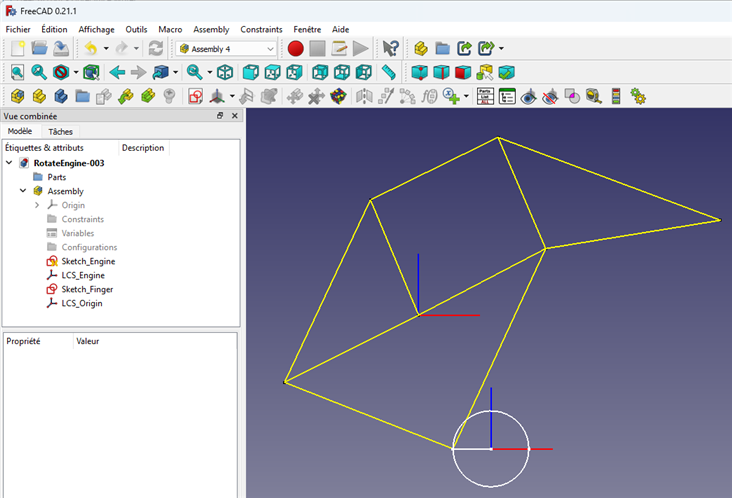
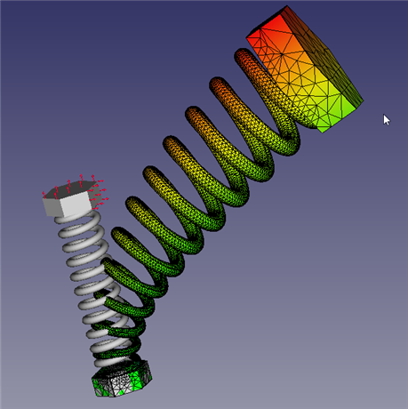

### RotateEngine
Simple Engine in Rotation thanks to Assembly 4

There is not that much tuto on it, you must carefully look to this Sample:

[Asm4_Tutorial4](https://github.com/Zolko-123/FreeCAD_Examples/tree/master/Asm4_Tutorial4)

Here is a video done with FreeCAD :

https://youtu.be/fnabEaYKOxI

### For finger prothesis

Thanks to Theo Jansen and his Walker

https://youtu.be/8iSupW6UVbI

### Perçage cylindre
Résoudre la difficulté de placer une esquisse sur un cylindre

### FEM-Ressort
Quelques essais de calculs aux éléments finis FEM (Finite Element Methode)
la résolution d'équation différentielles par le calcul aux éléments finis

### Tuto1
Des animations grâce à l'atelier Assembly 4 :

https://www.youtube.com/watch?v=NzxwSX3DTRU&t=24s

enregistrement d'une vidéo
Rotation-000.FCStd une rotation qui fonctionne

### Tuto0.1
J'essaye de créer la pièce avec Assembly 4 pour l'animer avec une variable d'angle.
comme dans Tuto0 :

https://www.youtube.com/watch?v=dye86KNPRjM

mais j'atteinds vite les limites de l'Assembly 4 quand je veux animer deux pièces avec deux angles différents ...

### Tuto0
Je voulais utiliser Assembly 4 et le gars me dit de ne pas faire ça mais d'utiliser les liens
du coup je me retrouve sans les fonctionnalités de l'extension "animation" 

